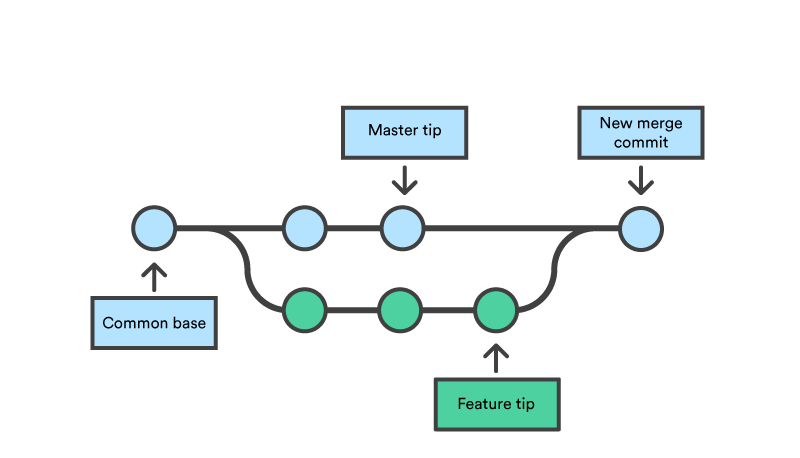

This notes are from jadi's introdutory course for Git.
# Table Of Content
- [What is Git?](#what-is-git)
- [Git Workspaces](#git-workspaces)
- [Report Commands](#report-commands)
- [File Modification](#file-modification)
- [Branches](#branches)
- [Git In The Cloud !](#git-in-the-cloud)
- [Conflicts](#conflicts)
- [Tags](#tags)
- [Sign Commites And Tags](#sign-commites-and-tags)
- [Debug With Git](#debug-with-git)


# What is Git 
Git is a Control version software. It's very usefull for control the changes in different version, team work : you can know who made this change and when. 

``` git init``` : add git space to folder.
``` git help Command``` : give manual of Command

# Git WorkSpaces

| Space | Function | Command |
| ------| -------  | ------- 
|Untracked | Git does nothing with this file and doesn't track this | 
| Stage | The space before `Commit` and after `Untracked` | **Add from Untrack to Stage** : ``` git add FileName```
| Commit | File which existed in Stage can commit (add to Project) | **Commit to Project** : ``` git commit -m "Message"```

**It is great to have more commits with less changes and good message. It helps contribute better.**

**If you don't use ```-m``` after `git commit`, terminal opens a space to write message. So it is a necessary step for compelting the `commit` command. (in that window use ctr to handle quite and other func)**

# Report Commands

``` git status ``` : Shows situation of files in folder (whether untracked, or had been modified or ready to commit)

``` git log ``` : Show all the changes (including commits, changes and so on) with user, its message, and commit time. Every commit has a unique **hash**.

```git show Hash``` : Show details of each commit with hash of Hash. 

# File Modification

```git diff filename``` : We can see the changes on file **before** add to stage space. 

```git reset filename``` : To exit file from stage mode. 

```git checkout -- filename``` : Discared change to file where added to stage space and revert changes.

```git mv OldFileName.py NewFileName.py``` : Change file name (need **commit** after this command)

```git rm filename``` : Remove file from git and system.

# Branches 

## Why use branches 
Suppose we have main project and we want to add some features to it. It is risky (and maybe not clean) to work on the main file. Git has a solution for us, **Branches**. 

## Commands
``` git branch ``` : Shows us Branches (And what branch we are currently working)

```git branch BranchName``` : Makes BranchName 

```git checkout BranchName``` : Switches to BranchName

``` git merge BranchName``` : Merges BranchName with active branch

``` git branch -d BranchName``` : Deletes BranchName


# Git in the cloud
With git we can work with repositories on the net or network but how? 

```git clone RepoAdress``` : it copy the repo to your local drive 
from now I will be **Master** and the first version of coppied source will be **Origin**

```git push origin master``` : After making changes to code where cloned, we can (if have authority) commit our changes to that repo. **This command pushes from origin to master**

```git pull origin master``` : This command commits from origin to master (kind of update local repo regardin to main repo)

## Remotes
Maybe we wanna add some remote repo to git space. we can do it with: 
```git remote add origin RepoAdress``` : This add RepoAdrees as origin.
Then we can push to origin with : ```git push origin master```

## Fork
What is Fork?
When you fork someone project you make copy of project on your account. You can edit it and make request to merge edits to main project.

# Conflicts

Sometimes we change a piece of code and want to push to origin but someone else edits that piece and pushed. **This is Conflict** and git can't push our code to repo becuse there is conflict between my change and the change have been made. 
Explain more: 
suppose someone delete a line in a code and push it to origin. i don't pull it from origin and in my local hard this code haven't been deleted. I make change on the line and wanna push it, clearly it is **Conflict**. 
So at first I must pull and then open the code and solve the conflict.


# Tags
When we release new version we are on master branch (not any other) and have a lot of commits. But later how can we back on previous verison? With **Tags** 

```git tags``` : Show all tags

```git tag -a TagName -m "Message"``` : -a : annoate , this adds TagName to currant project. Tags dont commit so in the push they don't push normally. We can push them with : ```git push origin TagName``` or push all tags with : ```git push origin --tags```
Also, we can tag on specific commits with ```git tag -a TagName CommitHash```

```git tag -l "Tagname"``` : Search in the tags

```git show TagName``` : Show detail of TagName (Messages,Commites and so on)

To come back to previous version (tag) : ```git checkout TagName``` but for changes it is better or maybe neccecory to creat branch and made changes on it with : ```git checkout -b BranchName```


# Sign Commites And Tags
## Why to sign? 
Because it is a secure way to show that the commit Undoubtedly belongs to you.

## How Does it Work? 
You have your own secret key (which sign with it) and public key which others know this and when see tags and commite with that key, understand you made this change. 

For generate secure sign we use **gpg**.

```gpg --list-keys``` Show lists of gpg keys on pc 
```gpg --list-keys --keyid-format LONG``` Show detail of keys 

```gpg --gen-key``` generate new key

In git : 
```git config --global user.signinkey KEY``` This change sign key in git to one We already create with gpg. But What is KEY? in the image below the phrase in 'sec' line after '/' is KEY. and the below one is public key.


```git tag -s TagName -m "Message"``` Sign the Tag. 
To show tag with sign use ```git show TagName```
To verify tag with sign use ```git tag -v TagName```

```git commit -S -m "Message"``` Sign commit  

# Debug With Git 

## Blame Who Made Bug!
If we know piece of code is bug and want to know who made this bug : 
``` git blame FileName``` : Show who write each line of code 
``` git blame FileName -L 10(,12)``` : Show history of line 10 (lines between 10 and 12 )

## Git Debug Proccess 
Bisect : Binary Search Commit

```git bisect start``` : Start directory of search 

```git bisect bad``` : Mark current dir as Bad . We can add HashOfCommit after bad

```git bisect good``` : Mark currant dir as Good, We can add HashOfCommit after good

and it starts binary search to find buggy code. 


پ.ن: این متن یک خلاصه از دوره مقدماتی جادی هست که برای تمرین خودم به زبان انگلیسی&#x202b; نوشتم و قطعا خالی از اشکالات گرامری و لغتی نیست. اگه مشکلی بود خوشحال میشم اطلاع بدین. :)
