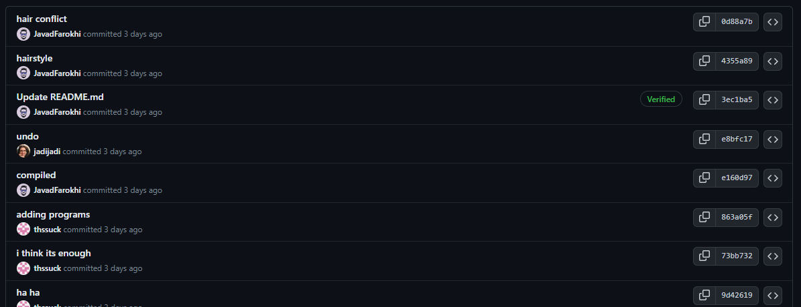

سلام. ممنون از آموزشتون درباره گیت. خیلی کمک کننده بود.

فقط اینکه موقع کار کردن با گیت یچیزی به نظرم عجیب بود اینکه موقع شروع به کار ازم خواست تا با دستور زیر ایمیل خودمو وارد کنم که ببینه من کیم.
ولی پسورد یا چیزی که بتونم باهاش وریفای کنم که منم ازم نخواست. 
و خب منم همینطوری یچیزی وارد کردم.

`git config --global user.email "harchi"`

چندتایی فایل کامیت کردم دیدم که عکس پروفایلمو تو قسمت اطلاعات کامیت‌ها نمیاره و کلا لینک هستش به اکانته ینفر دیگه (نگو اون ایمیله که وارد کرده بودم واسه اون طرف بوده و کامیت به اسم اون طرف ثبت میشده).

من برداشتم این بود که چون که با GPG KEY وریفای میکنن دیگه اینورو باز گذاشتن و فقط کامیت‌هایی اعتبار دارن که وریفای شده باشن (یذره کارو سخت کرده بنظرم).

پ‌ن: با توجه به اسم اکانت کامیتای پایین‌تر؛ اول فکر کردم گیت‌هاب فهمیده کدهام محتوای خاصی نداره؛ میخواد به روم بیاره :)))))))

اگر نباید اینطوری پول ریکوئست میدادم عذرخواهی میکنم.
